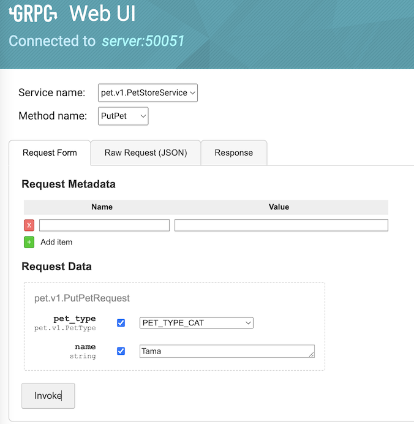
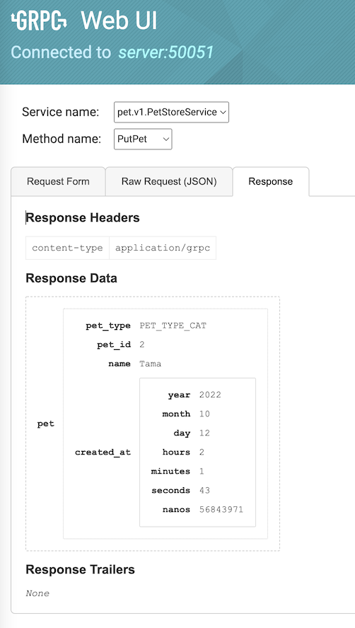
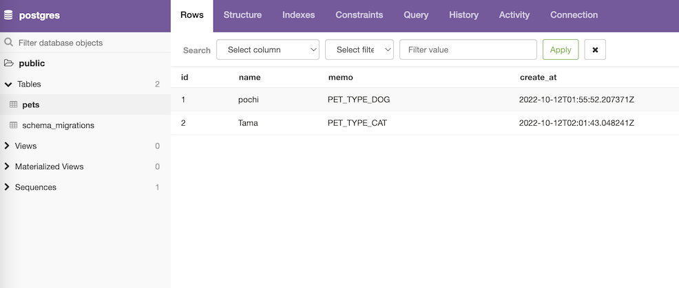
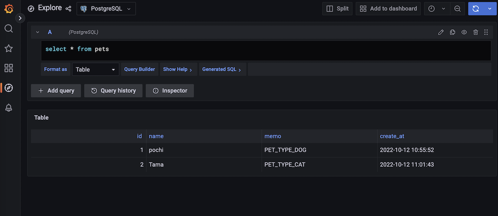

# sqlc-buf-pg-template
SQL query driven backend template with sqlc, gRPC and postgres and also visualized by pgweb and grafana.

## HOW TO USE
 1. Write proto files and edit buf yamls (`buf.work.yaml`, `buf.gen.yaml` and `buf.yaml`)
 1. Write the configuration for sqlc in `sqlc.yaml`, SQL Table Schema in `schema.sql` and SQL query for the services in `query.sql`.
See [sqlcを使って簡単なウェブアプリケーションを作る](https://zenn.dev/nnabeyang/articles/697c6b65c1a7bd) [query annotations](https://docs.sqlc.dev/en/stable/reference/query-annotations.html).
 1. Write proto files in `/petapis/pet/v1/pet.proto`.
 1. To make a new migration file, run
    ```bash
    docker-compose -f docker-compose.dbmate_new.yml up
    ```
    Then you'll get the new migration file in `/petapis/migrations` directory.
 1. Then write the migration code in the migration sql file.
 1. To make a schema file, run
    ```bash
    docker-compose -f docker-compose.dbmate.yml up
    ```
    Then you'll get the new schema file `/petapis/schema/schema.sql`.
 1. To generate pb files in `/gen`, write  and the autogenerated package to handle SQL, execute
    ```bash
    docker-compose -f docker-compose.autogen.yml
    ```
 1. Implement ```adaptor.go``` by the autogenerated codes in `/gen`.
 1. To run the server, run
    ```bash
    docker-compose up
    ```
 1. You can access dashboards.
    - To see the gRPC Web UI [http://localhost:8080/](http://localhost:8080/)
    - To see the pgweb [http://localhost:8081/](http://localhost:8081/)
    - To see the grafana [http://localhost:3000/](http://localhost:3000/)
 1. Paste `/petapis/schema/schema.sql` to "Query" in pgweb and execute. Then the table schema will be created.
 1. Post/Get/Delete Pet data by gRPC Web UI.
   
   
 1. You can see the data in pgweb and in grafana also.
   
   


## TODO
 - `buf lint`
 - `buf breaking`
cf. https://zenn.dev/y16ra/articles/23e0cd68251554
